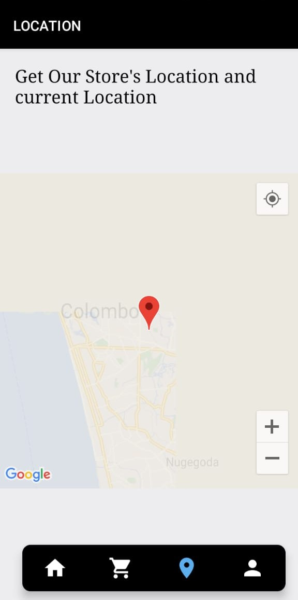

# Aqua-Delivery
A water can order app is a mobile application designed to streamline the process of ordering and delivering water cans to homes, offices, or other locations. This app allows users to place orders for various quantities of bottled water cans, typically in different sizes and brands, with just a few taps on their smartphones. Users can often customize their orders based on their specific water needs.

  
  
  
  
  
  

